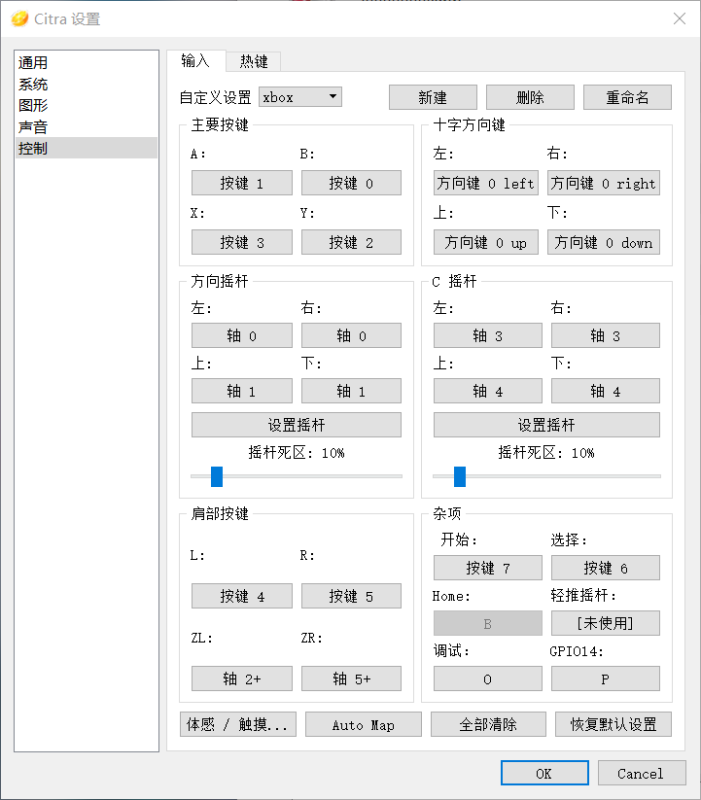

# 联机群：685228549

# 目录

[TOC]

# PC端 citra模拟器

群文件有PC端最新的官方citra模拟器，解压直接运行citra-qt.exe

官方发布地址https://github.com/citra-emu/citra-canary/releases（国内进不去）

不推荐citra官方下载页面下载，下载的只是个安装器，不是模拟器本体，需要在线安装（国内连不上网）

# 安卓3ds模拟器 官方版

不建议用官方，无法联机

# 安卓3ds模拟器 MMJ

1.首先，MMJ模拟器是国内大佬MMJ优化的官方citra安卓版，是开源项目，还在频繁更新，特点是加入了对于麒麟CPU的优化，且支持多人联机，去掉了即时存档。

可在群文件下载

2.微博搜作者本人，他会发百度网盘地址
作者本人github开源项目会发布打包好的最新版apk

3.如果想第一时间获取最新的版本或者加入开发，github该项目地址为https://github.com/weihuoya/citra/releases/tag/20210820 版本获取点击releases是版本发布
因为外网，全程可能需要特殊上网手段（不做讨论）

# 下载游戏

1.安卓端最傻瓜下载游戏方式为，手机应用市场下载安装`爱吾游戏盒子`搜索游戏下载安装，直到爱吾模拟器中能玩，再打开citra模拟器也会有对应游戏和金手指。

安卓端只有MMJ模拟器能够联机。

2.宝可梦cia游戏下载网址https://pokemon.anytype.top/，群自建高速下载网站，切勿外传。如安装cia时出现rom未解密的错误，扫描二维码进百度盘资源群下载cci格式的游戏

百度网盘资源群有包含3ds上所有原版及改版宝可梦下载

剑盾以及珍珠钻石

# 常见报错

cia本身问题，需要工具解密或下载cci格式（推荐），解密工具使用麻烦且有后续问题，该群不要问！

昵称过短，修改为4-20字符

citra模拟器版本太低，去群里下载最新的

信息输错了，再核对一遍，还是不行就是房间问题，换一个房间并联系群主反馈

# 联机指南

N2N是能够创建创建虚拟局域网的一款软件，同类型的还有游侠联机平台，蒲公英联机平台，hamachi，zerotier。通过虚拟局域网可以实现远程组建局域网环境来进行游戏联机，可以引用的有元气骑士、我的世界、饥荒、红警2、CSGO1.6等各类单机游戏联机。

| 名称           | W/S类型（平台）          | 服务器所在区域 | 是否需要账号 | 是否需要安装软件 |
| -------------- | ------------------------ | -------------- | ------------ | ---------------- |
| 游侠联机平台   | PC-server-PC             | **国内**       | 需要         | 需要             |
| 蒲公英联机平台 | Android-server-Android   | **国内**       | 需要         | 需要             |
| hamachi        | PC-server-PC & PC-PC     | 国外           | 需要         | 需要             |
| zerotier       | any-server-any & any-any | 国外           | 需要         | 需要             |
| N2N            | any-server-any & any-any | **国内**       | **无需**     | 需要             |
| citra服务器    | any-server-any           | **国内**       | 需要         | **无需**         |

W/S类型:即客户端-服务器类型

直连类型：

W/S与打洞（直连）模式：

各类方法中基本都离不开W/S中的服务端，但是在比较好的NAT类型下N2N,Hamachi与zerotier可以实现打洞，大幅降低延迟实现游戏直连（即使NAT类型不支持也会自动换为W/S模式）。比较好额NAT类型指网络不复杂，同一地域，同一网络运营商，比较少的交换机等环境。

**总结**：以上所有方式中N2N理论上联机体验最好，支持全平台联机，但是需要下载运行软件；citra服务器最简单高效，支持全平台联机，但是房间容易不稳定；蒲公英和游侠只能PC-PC或者安卓-安卓联机，需要软件和注册账号；hamachi与zerotier同N2N，需要软件与注册账号且服务器在国外。

> 故本群建议使用citra服务器或N2N联机。

## 1. citra服务器联机

### 1.1 注册

进入模拟器主界面

依次点击 `模拟-设置-通用-网络-注册`，之后会打开浏览器进入注册页面

 

之后登陆邮箱点击收到的邮件里面的网址激活账号

方法1：官网登录你的账号会跳转到[Your Account Information - Citra (citra-emu.org)](https://profile.citra-emu.org/)

如果没有看到token手动跳转该网址[Your Account Information - Citra (citra-emu.org)](https://profile.citra-emu.org/)

方法2：之后返回模拟器点击`我的令牌是？`

在网页里点击`here`

将获得的令牌输入进模拟器验证即可（可能会要一段时间才会生效，之后进行验证）

### 1.2 连接房间

点击`多人游戏-浏览公共大厅`

进入任意房间都可以。之后就可以进入游戏内联机了

安卓端进入游戏后点返回在菜单中选择多人游戏-加入房间，输入群里获取到的房间ip和端口号进入，自己的名称随意（20-40的字符）

准备完成进入游戏，联机，路人中可找到，注意对战和交换宝可梦时金手指和游戏加速会影响网络稳定性！

究极之日在元庆广场

## 2. N2N全平台联机

### 2.1 下载

群文件即可下载，pc端无需安装直接运行。

### 2.2 配置运行N2N

看自己平台根据下图配置。

配置名称（Setting name）：这个随便填

N2N版本（N2N version）：V3

N2N服务器节点ip（Supernode）：目前有三个服务器，s1与s2为bubg侠网免费提供的公共服务器，还有一个群主搭建的8.136.11.138

> s1为n2n.s1.bugxia.com:9527
>
> s2为n2n.s2.bugxia.com:9527
>
> 群服务器为8.136.11.138:777 

小组名称(community):citra

虚拟IP（ip address）：格式192.168.123.xxx

> 懂得交换知识的人自己随意填，这里只是给个参照和规范xxx部分可以为1-255，不要和其他玩家一样，虚拟IP为citra创建、加入房间需要用到的

其余的东西不要动之后保存配置（安卓端需要保持save后返回主页），点击灰色按钮变为蓝色即可联机，PC端点击三角运行

### 2.3 联机

#### PC端创建房间

打开citra，多人游戏-创建房间

只需要修改端口号（随意，自己记住发给队友），将上一节中N2N中的虚拟IP和这个房间端口号发给队友

#### 安卓端创建房间

进入游戏点击返回在菜单中选多人游戏-创建房间，ip书N2N中虚拟IP，端口号随意

加入房间可能会失败，多等十几秒再加入或尝试多次！！！

# 存档路径

电脑端：

打开citra，游戏列表里右键你要找存档的游戏

安卓端：

使用文件管理器

citra-emu/sdmc/Nintendo 3DS/00000000000000000000000000000000/00000000000000000000000000000000/title/00040000/titleid

| 游戏名     | titleid  |
| ---------- | -------- |
| 源蓝宝石   | 0011C400 |
| 究极红宝石 | 0011C500 |
| 究极之日   | 001B5000 |
| 究极之月   | 001B5100 |
| X          | 00055d00 |
| Y          | 00055E00 |

全titleid可参照http://3dsdb.com/

# 存档修改

在群文件下载PkHex.exe

安卓端也有，在群文件，安卓端很难用，使用前一定要开启**文件访问权限**和允许**安装应用未知来源**

# 图鉴

1.神奇宝贝百科https://wiki.52poke.com/wiki/%E4%B8%BB%E9%A1%B5

2.群文件安卓APP。神奇宝贝图鉴

3.群小程序七数宝可梦图鉴

# 手柄支持

citra全平台默认支持手柄，无需配置可直接使用

玩个别游戏xbox扳机键ZL、ZR映射可参照下图

